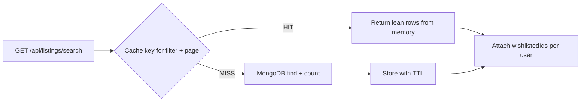

# Server caching

NullStay uses a **lightweight in-memory cache** to avoid repeating the same MongoDB queries for popular read paths. User-specific data (wishlists, sessions) is still loaded per request.

**Step-by-step build and runtime flow:** [CACHING_GUIDE.md](./CACHING_GUIDE.md)

---

## What is cached

| Path | Cached data | Not cached |
|------|-------------|------------|
| `GET /` | Featured listings (8 newest) | Your wishlist hearts |
| `GET /listings` | First page of filtered listings | Wishlist IDs for logged-in users |
| `GET /api/listings/search` | Listing rows + total count per filter/page | `wishlistedIds` in the JSON response |
| `GET /listings/:id` | Listing + reviews + owner (lean) | `isWishlisted`, owner check |

**Static files** (`public/css`, `public/js`, images) get browser cache headers in production (`max-age` 1 day by default).

---

## Configuration (`.env`)

| Variable | Default | Description |
|----------|---------|-------------|
| `CACHE_ENABLED` | `true` | Set to `false` to disable all server caching |
| `CACHE_TTL_SECONDS` | `60` | How long each cache entry lives |
| `CACHE_MAX_ENTRIES` | `300` | Max keys in memory (oldest evicted first) |
| `STATIC_CACHE_MAX_AGE` | `1d` in production, `0` in dev | Express `maxAge` for `/public` assets |
| `CACHE_DEBUG` | off | Set to `true` to send `X-Cache: HIT` or `MISS` on API search |

---

## Invalidation

Cache is cleared automatically when:

- A listing is **created**, **updated**, or **deleted**
- A **review** is added or removed on a listing

Updates to a single listing also drop that listing’s detail cache and refresh catalog search keys on the next request (after TTL or full prefix clear).

---

## Architecture

Implementation:

- `utils/cache.js` — TTL map
- `config/cache.js` — env wiring
- `utils/listingCache.js` — listing-specific keys and helpers
- `utils/wishlistIds.js` — per-user wishlist lookup

---

## Production notes

- This cache is **per server process**. If you run multiple Node instances, each has its own memory; use Redis later if you need a shared cache.
- Short TTL (30–120 seconds) is usually enough for listing browse traffic without stale data after host edits.
- For **offline / PWA** caching, see `roadmap.md` (Service Workers).
