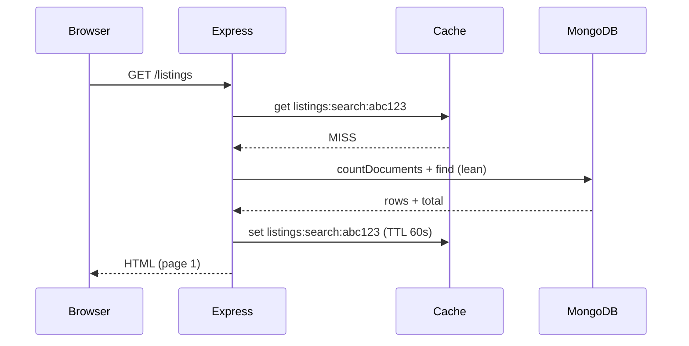
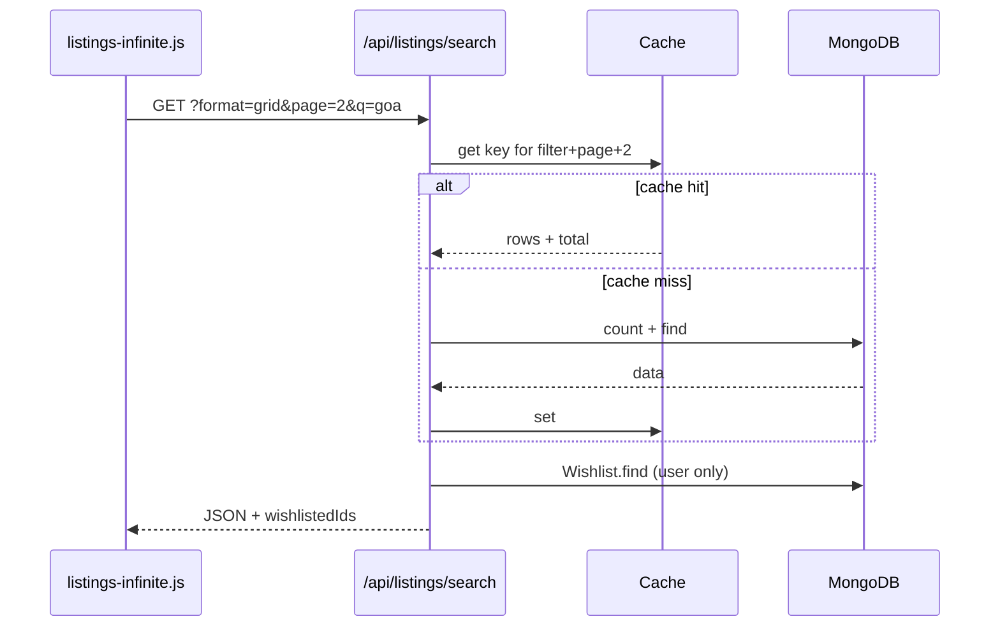

# Caching: how we built it and how it works

This guide walks through **why** NullStay has caching, **how we implemented it step by step**, and **what happens on each request**. For a short reference (env vars, invalidation rules), see [CACHING.md](./CACHING.md).

---

## 1. The problem

Before caching, every visit to popular pages hit MongoDB repeatedly:

- **Home** — `find()` for 8 featured listings + reviews
- **Listings browse** — `countDocuments()` + `find()` for page 1
- **Infinite scroll** — same queries again for page 2, 3, … with the same filters
- **Listing detail** — `findById()` with nested `populate` for reviews and owners

Many users see the **same listing data** at the same time. Only **wishlists** and **login state** differ per user. Caching lets us store shared catalog data once in memory and still personalize wishlist hearts per request.

---

## 2. Design choices

| Decision | Why |
|----------|-----|
| **In-memory cache** (not Redis yet) | No extra service; fits a single Node server; easy to add later |
| **TTL (time-to-live)** | Entries expire after ~60s so stale data does not live forever |
| **Cache lean MongoDB objects** | `.lean()` returns plain JSON-safe objects, not Mongoose documents |
| **Do not cache user-specific fields** | Wishlist IDs and `isWishlisted` are always fetched per user |
| **Invalidate on writes** | Create/update/delete listing or review clears affected cache keys |
| **Browser cache for static files** | CSS/JS/images use Express `maxAge` in production |

We did **not** cache sessions, bookings, messages, or checkout — those must always be fresh and user-specific.

---

## 3. Step-by-step: how we built it

### Step 1 — Generic TTL cache (`utils/cache.js`)

We added a small reusable cache with no npm dependency:

1. Store entries in a JavaScript `Map`: `key → { value, expiresAt }`
2. **`get(key)`** — return value if present and not expired; otherwise delete and return `undefined`
3. **`set(key, value, ttlMs)`** — store with expiry time
4. **`invalidatePrefix(prefix)`** — delete all keys starting with e.g. `listings:`
5. **`maxEntries`** — when full, remove oldest keys (FIFO)

This module knows nothing about listings; any feature can use `createCache()`.

### Step 2 — Wire environment variables (`config/cache.js`)

We read `.env` once at startup and export a single shared instance:

```text
CACHE_ENABLED      → default on (only "false" disables)
CACHE_TTL_SECONDS  → default 60
CACHE_MAX_ENTRIES  → default 300
```

`cacheTtlMs` converts seconds to milliseconds for `set()`.

### Step 3 — Listing-specific helpers (`utils/listingCache.js`)

This layer defines **cache keys** and **what to store**:

| Helper | Cache key example | Stored value |
|--------|-------------------|--------------|
| `getCachedListingSearch()` | `listings:search:<hash>` | `{ total, pagination, rows }` |
| `getCachedFeaturedListings()` | `home:featured:8` | array of 8 listings |
| `getCachedListingDetail()` | `listing:<id>` | one listing + reviews + owner |

Keys for search use a **stable hash** of `{ filter, page, perPage }` so different filters and pages never collide.

**Invalidation:**

- `invalidateListingsCache()` — clears all `listings:`, `home:`, and `listing:` keys (e.g. new listing)
- `invalidateListingDetail(id)` — drops one detail key + catalog/home prefixes (e.g. edit or new review)

### Step 4 — Per-user wishlist helper (`utils/wishlistIds.js`)

Wishlists are **never** put in the shared cache. `getWishlistedIdsForUser(userId, listingIds?)` runs a small `Wishlist.find()` on every request that needs hearts.

- Home: all wishlisted IDs for the user
- API scroll: only IDs for listings on the current page
- Listing show: `Wishlist.findOne()` for that listing (unchanged from before)

### Step 5 — Static asset caching (`middleware/staticCache.js`)

In `index.js`, static files are served with:

```js
app.use(express.static("public", getStaticCacheOptions()));
```

Production defaults to `maxAge: "1d"` plus `etag` and `lastModified`. Development uses `0` so CSS/JS changes show up immediately.

### Step 6 — Plug into routes

**Home (`index.js`)**

```text
Before: listings.find().limit(8).populate("reviews")
After:  getCachedFeaturedListings(listings, 8)
        + getWishlistedIdsForUser(req.user?._id)
```

**Listings page (`routes/listingRoute.js` — `GET /`)**

```text
Before: countDocuments + find (page 1)
After:  getCachedListingSearch(listings, { filter, page: 1, perPage: 12 })
        + getWishlistedIdsForUser(req.user?._id)
```

**API infinite scroll (`routes/apiListingRoute.js` — `GET /search`)**

```text
Before: countDocuments + find per request
After:  getCachedListingSearch(...)
        + getWishlistedIdsForUser for rows on this page only
        + optional X-Cache: HIT | MISS when CACHE_DEBUG=true
```

**Listing detail (`routes/listingRoute.js` — `GET /:id`)**

```text
Before: findById + populate (every time)
After:  getCachedListingDetail(listings, id)
        + isWishlisted / isOwner still computed per request
```

### Step 7 — Clear cache when data changes (`routes/listingRoute.js`)

| Action | Call |
|--------|------|
| Create listing | `invalidateListingsCache()` |
| Update listing | `invalidateListingDetail(id)` |
| Delete listing | `invalidateListingDetail(id)` |
| Add review | `invalidateListingDetail(id)` |
| Delete review | `invalidateListingDetail(id)` |

### Step 8 — Document and configure

- [CACHING.md](./CACHING.md) — quick reference
- [.env.example](../.env.example) — commented cache variables
- [PAGINATION.md](./PAGINATION.md) — note that API pages use this cache
- Server startup log in `index.js` prints whether cache is enabled

---

## 4. How it works at runtime

### Example A — Guest opens `/listings`



Second guest with the **same filters** within 60 seconds:

```text
Cache HIT → no MongoDB for count/find → faster HTML
```

### Example B — Logged-in user scrolls (infinite scroll)



The **listing rows** may come from cache; **wishlistedIds** always come from MongoDB for that user.

### Example C — Host edits a listing

```text
PUT /listings/:id  →  save to MongoDB
                  →  invalidateListingDetail(id)
                  →  clears listing:<id> and all listings: / home: keys
Next GET /listings/:id  →  cache MISS → fresh data from DB
```

### Example D — Static file in production

```text
GET /css/home.css
→ Express static middleware
→ Response includes Cache-Control (max-age ~1 day)
→ Browser reuses file until expiry (or validates with ETag)
```

---

## 5. Cache key layout

```text
home:featured:8              → 8 newest listings for home page

listings:search:<16-char-hash>  → search result for one filter + page
  hash = SHA256({ filter, page, perPage })

listing:507f1f77bcf86cd799439011  → single listing detail document
```

Prefixes make bulk invalidation simple: delete every key that starts with `listings:`.

---

## 6. File map

| File | Role |
|------|------|
| `utils/cache.js` | Generic TTL `Map` cache factory |
| `config/cache.js` | Singleton cache + env TTL / max size |
| `utils/listingCache.js` | Keys, get/set helpers, invalidation |
| `utils/wishlistIds.js` | Per-user wishlist (never cached) |
| `middleware/staticCache.js` | Browser cache headers for `public/` |
| `index.js` | Home route + static middleware + startup log |
| `routes/listingRoute.js` | Listings index, show, invalidation on writes |
| `routes/apiListingRoute.js` | Infinite-scroll API |

---

## 7. How to verify it works

1. **Restart the server** after changing `.env`.
2. Confirm startup log: `Cache: enabled (TTL 60s, ...)`.
3. Open `/listings` twice — second load should feel snappier (DB work skipped on HIT).
4. Enable debug:

   ```env
   CACHE_DEBUG=true
   ```

5. Scroll on `/listings` and watch Network tab for `GET /api/listings/search`:
   - First request for a page/filter: `X-Cache: MISS`
   - Repeat within TTL: `X-Cache: HIT`
6. Edit a listing as host — next view should show updates (cache invalidated).
7. Disable entirely: `CACHE_ENABLED=false` — app behaves like before caching.

---

## 8. Limits and future improvements

| Topic | Current behavior | Possible upgrade |
|-------|------------------|----------------|
| Multiple servers | Each Node process has its own memory | Redis or Memcached shared cache |
| Very long TTL | Users might see old prices briefly | Shorter TTL or stricter invalidation |
| Offline app | Not covered here | Service Worker + `CacheStorage` (see `roadmap.md`) |
| Booking / messages | Not cached | Keep as-is for correctness |

---

## 9. Related docs

- [CACHING.md](./CACHING.md) — configuration and invalidation cheat sheet
- [PAGINATION.md](./PAGINATION.md) — infinite scroll (uses cached API responses)
