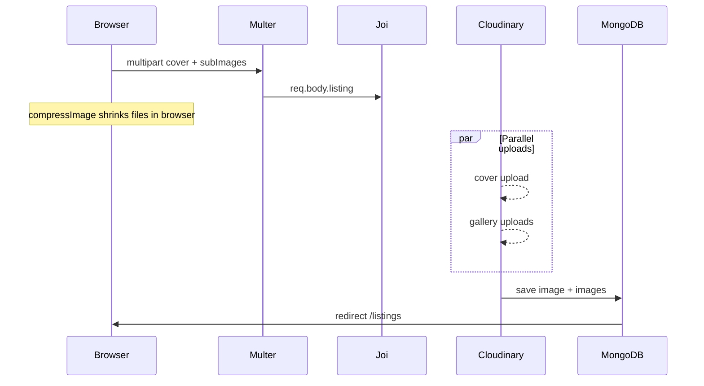

# Null Stay — Cloudinary Image Upload Guide

Step-by-step documentation for **cover photo** and **gallery (sub) images** on Null Stay: setup, flow, performance, and fixes for common issues.

---

## Table of contents

1. [What we built (big picture)](#1-what-we-built-big-picture)
2. [Phase 1 — Cloudinary account & packages](#2-phase-1--cloudinary-account--packages)
3. [Phase 2 — Environment variables](#3-phase-2--environment-variables)
4. [Phase 3 — Cloudinary config](#4-phase-3--cloudinary-config)
5. [Phase 4 — Multer (receive files in Express)](#5-phase-4--multer-receive-files-in-express)
6. [Phase 5 — Upload to Cloudinary](#6-phase-5--upload-to-cloudinary)
7. [Phase 6 — MongoDB listing model](#7-phase-6--mongodb-listing-model)
8. [Phase 7 — Listing routes (create / update / delete)](#8-phase-7--listing-routes-create--update--delete)
9. [Phase 8 — Joi validation](#9-phase-8--joi-validation)
10. [Phase 9 — Forms & UI](#10-phase-9--forms--ui)
11. [Phase 10 — Show page & photo modal](#11-phase-10--show-page--photo-modal)
12. [Phase 11 — Gallery (sub-images)](#12-phase-11--gallery-sub-images)
13. [Phase 12 — Client 5 MB limit](#13-phase-12--client-5-mb-limit)
14. [Phase 13 — Speed & compression](#14-phase-13--speed--compression)
15. [Issues & solutions (quick reference)](#15-issues--solutions-quick-reference)
16. [File checklist](#16-file-checklist)
17. [How to test](#17-how-to-test)

---

## 1. What we built (big picture)

### Before

- Hosts pasted an **image URL** in a text field.
- Listing show page used **hardcoded Unsplash** placeholders for the photo grid.

### After

| Feature | Storage | Field in MongoDB |
|--------|---------|------------------|
| **Cover photo** (large grid image) | Cloudinary | `listing.image` → `{ url, filename }` |
| **Gallery photos** (up to **5** extra) | Cloudinary | `listing.images[]` → `[{ url, filename }, ...]` |

`filename` = Cloudinary **public_id** (used to delete or replace images).

### Request flow (create listing)



---

## 2. Phase 1 — Cloudinary account & packages

1. Create a free account at [cloudinary.com](https://cloudinary.com).
2. Copy from **Dashboard**: Cloud name, API Key, API Secret.
3. Install packages:

```bash
npm install cloudinary multer
```

| Package | Role |
|---------|------|
| `cloudinary` | Upload / delete on Cloudinary |
| `multer` | Parse `multipart/form-data` |

---

## 3. Phase 2 — Environment variables

Add to `.env` (never commit this file):

```env
CLOUDINARY_CLOUD_NAME=your_cloud_name
CLOUDINARY_API_KEY=your_api_key
CLOUDINARY_API_SECRET=your_api_secret

# Optional — direct browser upload (faster, advanced)
# CLOUDINARY_UPLOAD_PRESET=your_unsigned_preset_name
```

**Issue — config empty at startup**

Load `.env` inside `config/cloudinary.js` **before** `cloudinary.config()`, not only in `index.js` after imports.

---

## 4. Phase 3 — Cloudinary config

**File:** `config/cloudinary.js`

- Import Cloudinary v2.
- Load dotenv, then `cloudinary.config({ cloud_name, api_key, api_secret })`.
- Export default cloudinary instance.
- No debug `console.log` in production path (only `console.error` on upload failure in `uploadToCloudinary.js`).

---

## 5. Phase 4 — Multer (receive files in Express)

**File:** `middleware/uploadMiddleware.js`

| Setting | Value |
|---------|--------|
| Storage | `memoryStorage()` (buffer in RAM → stream to Cloudinary) |
| Filter | Images only (`mimetype` starts with `image/`) |
| Max size | **5 MB per file** |
| Fields | `image` (max 1), `subImages` (max **5**) |

```javascript
export const listingUpload = upload.fields([
  { name: "image", maxCount: 1 },
  { name: "subImages", maxCount: 5 },
]);
```

After Multer:

- Cover → `req.files.image[0]`
- Gallery → `req.files.subImages` (array)

**Limits aligned:** `LISTING_MAX_GALLERY_IMAGES = 5` in `utils/constants.js`, Multer `maxCount: 5`, UI `maxGallery: 5`.

---

## 6. Phase 5 — Upload to Cloudinary

### `utils/uploadToCloudinary.js`

- `upload_stream` into folder `null-stay/listings`.
- Pipe buffer: `Readable.from(buffer).pipe(uploadStream)`.

### `utils/cloudinaryImages.js`

| Function | Purpose |
|----------|---------|
| `uploadFilesToCloudinary(files)` | Upload **all gallery files in parallel** (`Promise.all`) |
| `uploadCoverImage` (in route) | Single cover upload |
| `destroyCloudinaryImage(id)` | Delete one asset |
| `destroyCloudinaryImages(ids)` | Delete many in parallel |
| `destroyListingImages(listing)` | Delete cover + gallery |
| `normalizeRemoveIds(value)` | Parse `removeSubImages[]` from form |

---

## 7. Phase 6 — MongoDB listing model

**File:** `models/listing.js`

```javascript
image: { filename: String, url: String },
images: [{ url: String, filename: String }],
```

Image data is set in routes after Cloudinary upload — **not** from raw form URL fields.

---

## 8. Phase 7 — Listing routes (create / update / delete)

**File:** `routes/listingRoute.js`

**Middleware order:**

```
isLoggedIn → listingUpload → validateListing → handler
```

### Create — `POST /listings`

1. Require cover file `req.files.image[0]`.
2. **Parallel:** `uploadCoverImage(cover)` + `uploadFilesToCloudinary(subImages)` via `Promise.all`.
3. Save listing with `markModified("image")` and `markModified("images")`.
4. Redirect `/listings`.

### Update — `PUT /listings/:id`

1. Copy `req.body.listing` but **delete** `image` and `images` before `Object.assign` (avoid wiping uploads).
2. **Parallel:** cover replace (if new file) + `applyGalleryUpdates()` via `Promise.all`.
3. `markModified` + `save()`.

### `applyGalleryUpdates()`

1. `removeSubImages[]` → delete on Cloudinary in parallel → filter from array.
2. Upload new `subImages` in parallel → append (respect max **5** total).
3. Set `listing.images`.

### Delete — `DELETE /listings/:id/delete`

`destroyListingImages(listing)` then `findByIdAndDelete`.

### Optional — direct browser upload

`GET /listings/upload-config` (logged in) returns `cloudName`, `uploadPreset`, `folder` when `CLOUDINARY_UPLOAD_PRESET` is set. Browser can upload straight to Cloudinary and POST only URLs — not required for basic flow.

---

## 9. Phase 8 — Joi validation

**Files:** `schemas/listing.js`, `middleware/validationMiddleware.js`

- Validate **only** `req.body.listing` (not full `req.body`).
- Do **not** include `image` / `images` in Joi.
- Use `stripUnknown: true`, `convert: true` for multipart number fields.

**Issue — `"image" is not allowed`**

Multer puts `image` on root `req.body`. Validating only `req.body.listing` fixes it.

**Issue — misleading error page**

`views/listings/error.ejs` now shows real messages for 400 vs 404.

---

## 10. Phase 9 — Forms & UI

### Cover — `views/includes/imageUploadField.ejs`

- `enctype="multipart/form-data"` on form.
- `name="image"`, `accept="image/*"`.
- Custom dropzone + `public/js/imageUpload.js`.

### Scripts (new & edit listing)

```html
<script src="/js/imageFileLimits.js"></script>
<script src="/js/compressImage.js"></script>
<script src="/js/newListing.js"></script>
<script src="/js/imageUpload.js"></script>
<script src="/js/galleryUpload.js"></script>
<script src="/js/listingFormLoading.js"></script>
```

Use `newListing.js` — **not** `multiStepForm.js` (file does not exist).

---

## 11. Phase 10 — Show page & photo modal

- **`show.ejs`:** Cover + first 4 gallery images in grid; “Show all X photos” when gallery exists.
- **`photosModal.ejs`:** Cover + full gallery grid.

---

## 12. Phase 11 — Gallery (sub-images)

### `views/includes/galleryUploadField.ejs`

- `name="subImages"` with `multiple`.
- Up to **5** photos; hint “max 5 MB each”.
- Edit: existing grid + × to mark `removeSubImages[]`.

### `public/js/galleryUpload.js`

- In-memory `selectedFiles` + `DataTransfer` sync to input.
- **Critical:** Do **not** run `input.value = ""` after select — that clears files before submit.
- On form **submit** (capture): call `syncInputFiles()` so files are attached.

**Issue — edit “success” but no images / not on Cloudinary**

**Cause:** `input.value = ""` after picking gallery files cleared the file input before POST.

**Solution:** Removed that line; sync files on submit.

---

## 13. Phase 12 — Client 5 MB limit

**File:** `public/js/imageFileLimits.js`

- Max **5 MB per file** (matches Multer).
- `isImageFileTooLarge(file)`, `imageFileSizeError(file)`.

**`imageUpload.js` / `galleryUpload.js`**

- Reject oversized files when selected (red message, red border).
- `newListing.js` blocks submit if any file still too large.

**Why:** Avoid 413 *“The file you are trying to upload is too large”* only after a long wait.

---

## 14. Phase 13 — Speed & compression

### Why saves felt slow (3–4 seconds)

Uploads used to run **one after another** (cover, then each gallery image). Five images ≈ five round trips to Cloudinary.

### What we did

| Optimization | Where |
|--------------|--------|
| Parallel gallery uploads | `uploadFilesToCloudinary` → `Promise.all` |
| Parallel cover + gallery on create | `listingRoute.js` POST |
| Parallel cover update + gallery on edit | `listingRoute.js` PUT |
| Parallel Cloudinary deletes | `destroyCloudinaryImages` |
| Client compression | `compressImage.js` — max 1600px, JPEG ~82%, skip if &lt; 400 KB |
| Saving indicator | `listingFormLoading.js` — button shows spinner + “Saving…” |

### `public/js/compressImage.js`

Runs in browser before submit → smaller payloads → faster upload to server and Cloudinary.

### Expected timing

- **Before:** ~3–4 s with several large images (sequential).
- **After:** often ~1–2 s (parallel + smaller files), network dependent.

### Optional — faster still

Add unsigned preset to `.env` and use `GET /listings/upload-config` so the browser uploads directly to Cloudinary (bypasses Express for file bytes). See Cloudinary dashboard: Upload presets → Unsigned → folder `null-stay/listings`.

---

## 15. Issues & solutions (quick reference)

| # | Issue | Cause | Solution |
|---|--------|--------|----------|
| 1 | 400 `"image" is not allowed` | Joi on full `req.body` | Validate only `req.body.listing` |
| 2 | “Can't find that page” on 400 | Static error template | Status-based message in `error.ejs` |
| 3 | Cover not uploaded | Missing `enctype` | `multipart/form-data` on form |
| 4 | Cloudinary keys missing | dotenv order | Load `.env` in `config/cloudinary.js` |
| 5 | `req.file` undefined | `.fields()` not `.single()` | `req.files.image[0]` |
| 6 | 413 file too large | File &gt; 5 MB | Client check + Multer limit; compress or resize |
| 7 | Gallery not saved on edit | `input.value = ""` cleared files | Remove clear; sync on submit |
| 8 | Images not in MongoDB after edit | `Object.assign` overwrote `images` | Strip `image`/`images` from body before assign; `markModified("images")` |
| 9 | Slow create/edit | Sequential Cloudinary uploads | `Promise.all` parallel uploads |
| 10 | Multi-step broken | Wrong script | Use `newListing.js` |

---

## 16. File checklist

| File | Role |
|------|------|
| `.env` | `CLOUDINARY_*` (+ optional `CLOUDINARY_UPLOAD_PRESET`) |
| `config/cloudinary.js` | SDK + dotenv |
| `middleware/uploadMiddleware.js` | Multer `listingUpload` |
| `utils/uploadToCloudinary.js` | Stream one buffer to Cloudinary |
| `utils/cloudinaryImages.js` | Parallel batch upload / delete |
| `utils/constants.js` | `LISTING_MAX_GALLERY_IMAGES`, `MAX_IMAGE_FILE_BYTES` |
| `models/listing.js` | `image` + `images[]` |
| `schemas/listing.js` | `listingBodySchema` |
| `middleware/validationMiddleware.js` | Validate listing body only |
| `routes/listingRoute.js` | CRUD + parallel uploads |
| `views/includes/imageUploadField.ejs` | Cover UI |
| `views/includes/galleryUploadField.ejs` | Gallery UI |
| `public/js/imageFileLimits.js` | 5 MB client rules |
| `public/js/compressImage.js` | Browser compression |
| `public/js/imageUpload.js` | Cover preview + size check |
| `public/js/galleryUpload.js` | Gallery preview + submit sync |
| `public/js/newListing.js` | Multi-step form + submit validation |
| `public/js/listingFormLoading.js` | Saving spinner on button |
| `views/listings/newListing.ejs` | Create form |
| `views/listings/editListing.ejs` | Edit form |
| `views/listings/show.ejs` | Photo grid |
| `views/includes/photosModal.ejs` | Full gallery modal |
| `middleware/errorMiddleware.js` | 413 / Multer errors |

---

## 17. How to test

### Create listing

1. Log in → **New listing** → fill steps.
2. Cover (required) + up to **5** gallery images (each ≤ 5 MB).
3. Publish → “Saving…” on button → redirect with success flash.
4. Cloudinary Media Library → `null-stay/listings`.
5. Listing show page → grid + modal show real images.

### Edit listing

1. Add/remove gallery photos → Save.
2. Confirm new images appear on site and in Cloudinary.

### Delete listing

1. Delete → cover + gallery removed from Cloudinary (valid `public_id`s only).

### If something fails

| Check | Look for |
|-------|----------|
| Terminal | `MulterError`, Joi, Cloudinary errors |
| Network tab | POST size, status 413/400 |
| `.env` | Three `CLOUDINARY_*` vars |
| Form | `enctype`, `name="image"` / `name="subImages"` |
| Gallery edit | Hard refresh after JS changes |

---

*Last updated: cover + gallery (max 5), parallel uploads, client 5 MB limit, compression, and gallery submit fix.*
