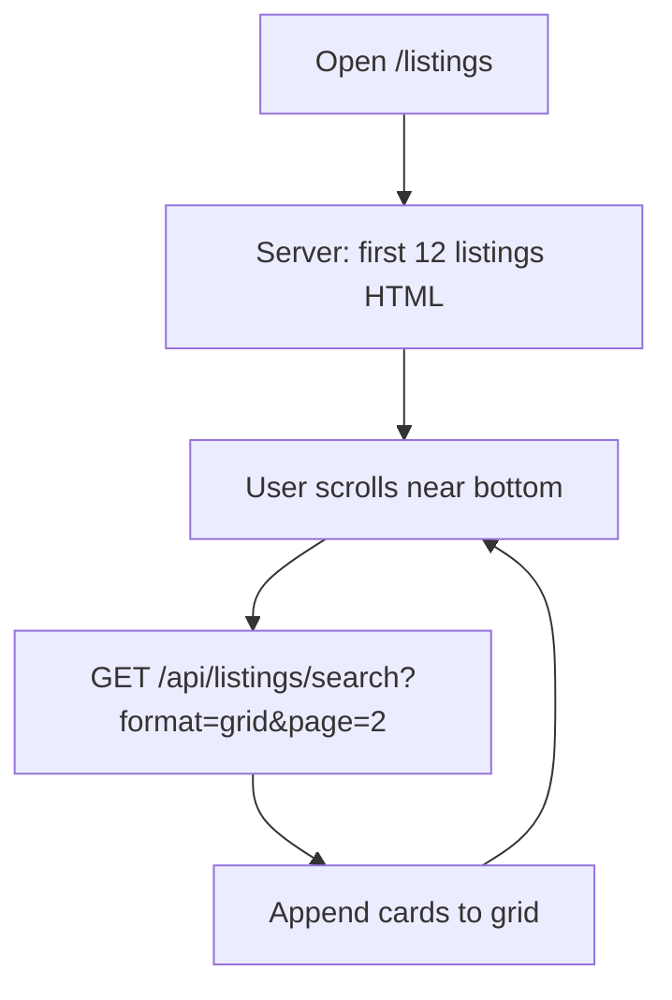

# Listings pagination (infinite scroll)

NullStay loads listings in **chunks** as you browse. The first batch appears when you open `/listings`; **more load automatically when you scroll down** — there are no page number buttons.

---

## Why not load everything at once?

Without chunking, the server would fetch every matching listing and review in one query. That gets slow as the catalog grows. Loading **12 listings at a time** (configurable) keeps the first paint fast.

---

## How it works



1. **`GET /listings`** renders the first page (up to `LISTINGS_PER_PAGE` cards) with search filters applied.
2. A hidden **sentinel** element sits below the grid.
3. When you scroll near it, **`listings-infinite.js`** calls the API for the next page.
4. New cards are **appended** to the grid. Wishlist hearts work on new cards (event delegation).
5. When there are no more results, you see **“You’ve seen all listings”**.

Search filters (`q`, `country`, `category`, `minPrice`, `maxPrice`, `guests`) are sent on every API request so scrolling stays filtered.

API pages are **server-cached** for a short TTL (see [CACHING.md](./CACHING.md)); wishlist state is still resolved per user on each response.

---

## URL format

| URL | Behavior |
|-----|----------|
| `/listings` | First chunk, all listings |
| `/listings?q=goa` | First chunk, filtered |
| `/listings?page=2` | **Ignored** for HTML — always starts at page 1; use scroll for more |

There is **no** `?page=` navigation in the UI. Pagination is scroll-only on the listings page.

---

## Configuration

| Setting | Location | Default |
|---------|----------|---------|
| Chunk size | `utils/constants.js` → `LISTINGS_PER_PAGE` | `12` |

Change that constant to load more or fewer cards per scroll (e.g. `20`).

---

## Code map

| File | Role |
|------|------|
| `utils/constants.js` | `LISTINGS_PER_PAGE` |
| `utils/pagination.js` | `getPaginationMeta`, `parsePage` (skip/limit math) |
| `utils/serializeListing.js` | `serializeListingForGrid` — JSON for new cards |
| `routes/listingRoute.js` | First page SSR + `scrollPagination` (`hasNext`, `total`) |
| `routes/apiListingRoute.js` | `GET /api/listings/search?format=grid&page=N` |
| `views/listings/listings.ejs` | Grid, sentinel, scroll status |
| `public/js/listings-infinite.js` | `IntersectionObserver` → fetch → append |
| `public/css/pagination.css` | Loading spinner and end message |

---

## API (scroll loads)

```http
GET /api/listings/search?format=grid&page=2&q=goa&limit=12
```

Important query params:

| Param | Purpose |
|-------|---------|
| `format=grid` | Returns grid card fields + `avgRating` |
| `page` | 1-based page number |
| `limit` | Max `LISTINGS_PER_PAGE` |
| `q`, `country`, `category`, … | Same filters as the listings page |

Example response:

```json
{
  "listings": [
    {
      "_id": "...",
      "title": "Goa villa",
      "location": "Goa",
      "country": "India",
      "price": 4500,
      "imageUrl": "https://...",
      "avgRating": "4.8"
    }
  ],
  "wishlistedIds": ["..."],
  "total": 48,
  "page": 2,
  "hasMore": true,
  "perPage": 12
}
```

Home page mocks use `format` omitted (default API shape with `media` for slideshows).

---

## UI states

| State | What you see |
|-------|----------------|
| Loading more | Rose spinner + “Loading more stays…” |
| End | “You’ve seen all listings” |
| Error | “Could not load more. Scroll to try again.” (scroll again to retry) |

If the first page already contains all results, the end message shows without scrolling.

---

## Manual testing

1. Ensure **more than 12** listings exist (or set `LISTINGS_PER_PAGE` to `2`).
2. Open `/listings` — only the first chunk appears; **no** Prev/Next buttons.
3. Scroll to the bottom — more cards load; spinner shows briefly.
4. Keep scrolling until **“You’ve seen all listings”**.
5. Try `/listings?q=goa` — scroll loads only matching stays.
6. Log in and toggle hearts on cards loaded via scroll.

---

## Home page vs listings page

| Feature | Listings `/listings` | Home mocks |
|---------|----------------------|------------|
| Load trigger | Scroll | Typing in search |
| UI | Full listing cards | Small preview cards |
| API | `format=grid` | default `format` |

Both reuse `GET /api/listings/search` and `utils/pagination.js` for page math.
