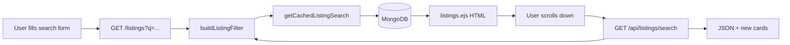

# NullStay — How listing search works

Step-by-step guide to the **stay search** feature: from the browser form to MongoDB and back. This covers the main search on `/listings`, not the map geocoder on a single listing page.

---

## Quick overview



| Layer | Role |
|-------|------|
| **UI** | HTML forms and category links send query params |
| **Routes** | `listingRoute.js` (first page) + `apiListingRoute.js` (load more) |
| **Filter builder** | `utils/listingSearch.js` → MongoDB filter object |
| **Data** | `getCachedListingSearch` in `utils/listingCache.js` |
| **Scroll** | `public/js/listings-infinite.js` fetches page 2+ |

---

## Step 1 — User starts a search (frontend)

Search never runs in the browser alone. The user submits a **GET form**, so filters live in the URL (shareable, bookmarkable).

### A) Navbar search (all pages using `boilerplate.ejs`)

File: `views/layouts/boilerplate.ejs`

- Click **search pill** → expanded panel (`public/js/script.js` toggles UI only).
- Form: `method="GET"` `action="/listings"`.

Query fields:

| Input `name` | Meaning |
|--------------|---------|
| `q` | Free text (city, title, “Goa”, etc.) |
| `country` | Country filter |
| `minPrice` / `maxPrice` | Price range (₹ per night) |
| `guests` | Minimum guest capacity |

Example URL after submit:

```
/listings?q=Goa&country=India&minPrice=1000&maxPrice=5000&guests=2
```

### B) Home page hero search

File: `views/home.ejs`

Simpler form — only `q` and `guests`:

```html
<form class="ns-hero-search" action="/listings" method="GET">
  <input name="q" ... />
  <input name="guests" ... />
</form>
```

### C) Help page search

File: `views/info/help.ejs`

Same idea: `GET /listings` with `name="q"`.

### D) Category chips (listings page only)

File: `views/layouts/boilerplate.ejs` (when `isListingsPage` is true)

Links like:

```
/listings?category=beachfront
/listings?category=pools
```

No JavaScript required — full page navigation.

### E) Home page **demo** search (preview only)

File: `public/js/home-mocks.js`

The animated mocks on the landing page call **`/api/listings/search`** via `fetch` for previews. That is separate from the real listings page flow.

---

## Step 2 — Express receives `GET /listings`

File: `routes/listingRoute.js`  
Mounted in `index.js` as: `app.use("/listings", listingRoute)`.

```js
router.get("/", wrapAsync(async (req, res, next) => {
  // If someone uses ?page=2 on the HTML route, redirect to page 1
  // (pagination for HTML is infinite scroll, not ?page=)
  if (req.query.page && parseInt(req.query.page, 10) > 1) {
    const q = { ...req.query };
    delete q.page;
    const qs = new URLSearchParams(q).toString();
    return res.redirect("/listings" + (qs ? `?${qs}` : ""));
  }

  const filter = buildListingFilter(req.query);
  const { pagination: scrollPagination, rows: allListing } =
    await getCachedListingSearch(listings, {
      filter,
      page: 1,
      perPage: LISTINGS_PER_PAGE, // 12
    });

  res.locals.searchQuery = req.query;
  // ... render listings.ejs
}));
```

**What happens here:**

1. `req.query` holds all URL params (`q`, `country`, `category`, etc.).
2. `buildListingFilter(req.query)` turns them into a MongoDB filter.
3. Only **page 1** is loaded for the initial HTML (12 listings).
4. `searchQuery` is passed to the template for chips, empty state, and scroll JS.

---

## Step 3 — Build the MongoDB filter

File: `utils/listingSearch.js`  
Function: `buildListingFilter(query)`

This is the **core search logic**. Everything else calls this function.

### 3.1 Text search (`q`) + category keywords

```js
const CATEGORY_KEYWORDS = {
  pools: ["pool", "swim"],
  beachfront: ["beach", "ocean", "sea", "coast"],
  castles: ["castle", "fort"],
  treehouses: ["treehouse", "tree house", "tree-house"],
  cabins: ["cabin", "cottage", "lodge"],
  cities: ["city", "apartment", "downtown", "urban"],
};
```

- If user typed `q=Goa`, that term is added.
- If user picked `category=beachfront`, keywords `beach|ocean|sea|coast` are added too.
- All terms are combined into one **case-insensitive regex** with `|` (OR).

```js
filter.$or = [
  { title: { $regex: pattern, $options: "i" } },
  { desc: { $regex: pattern, $options: "i" } },
  { location: { $regex: pattern, $options: "i" } },
  { country: { $regex: pattern, $options: "i" } },
];
```

So a listing matches if **any** of those fields contains **any** of the terms.

Special characters in `q` are escaped so regex stays safe:

```js
t.replace(/[.*+?^${}()|[\]\\]/g, "\\$&")
```

### 3.2 Country filter

```js
if (country?.trim()) {
  filter.country = { $regex: country.trim(), $options: "i" };
}
```

Runs **in addition** to `$or` text search (both must match).

### 3.3 Guests (minimum capacity)

```js
filter.guests = { $gte: n };
```

Listing must allow at least that many guests.

### 3.4 Price range

```js
filter.price = { $gte: minPrice, $lte: maxPrice };
```

Only fields the user filled are applied.

### Example: combined filter

URL: `/listings?q=loft&country=India&guests=2&minPrice=2000&category=cities`

MongoDB filter (conceptually):

```js
{
  $or: [
    { title: /loft|city|apartment|downtown|urban/i },
    { desc: /loft|city|apartment|downtown|urban/i },
    { location: /loft|city|apartment|downtown|urban/i },
    { country: /loft|city|apartment|downtown|urban/i },
  ],
  country: /India/i,
  guests: { $gte: 2 },
  price: { $gte: 2000 },
}
```

---

## Step 4 — Query database (with cache)

File: `utils/listingCache.js`  
Function: `getCachedListingSearch(listingsModel, { filter, page, perPage })`

### 4.1 Cache key

```js
listingsSearchCacheKey(filter, page, perPage)
// → "listings:search:" + sha256({ filter, page, perPage })
```

Same filters + page → same cache entry. TTL comes from `CACHE_TTL_SECONDS` in `.env`.

### 4.2 On cache miss

```js
const total = await listingsModel.countDocuments(filter);
const pagination = getPaginationMeta(total, page, perPage);
const rows = await listingsModel
  .find(filter)
  .populate("reviews")
  .sort({ createdAt: -1 })
  .skip(pagination.skip)
  .limit(pagination.limit)
  .lean();
```

| Step | Purpose |
|------|---------|
| `countDocuments` | Total matches (for “X results” and `hasMore`) |
| `getPaginationMeta` | `skip`, `limit`, `hasNext`, etc. (`utils/pagination.js`) |
| `find` + `sort` | Newest listings first |
| `populate("reviews")` | Needed for star ratings on cards |
| `lean()` | Plain objects (faster, good for read-only grid) |

### 4.3 Indexes (faster filters)

File: `models/listing.js`

Fields marked `index: true`: `title`, `price`, `location` (helps MongoDB, especially price and location filters).

---

## Step 5 — Render the first page (HTML)

File: `views/listings/listings.ejs`

### 5.1 Active filters UI

If any of `q`, `country`, `minPrice`, `maxPrice`, `guests`, `category` is set, the template shows result count and chips + **Clear all** → `/listings`.

### 5.2 Embed search state for JavaScript

```js
searchJson = JSON.stringify({
  q, country, minPrice, maxPrice, guests, category
});
```

On the grid element:

```html
<div id="listingsGrid"
  data-has-more="true|false"
  data-search="...encoded JSON..."
  data-per-page="12">
```

Infinite scroll reuses these params for page 2+.

### 5.3 Empty state

`totalCount === 0` → “No listings match your search” if filters were used.

### 5.4 SEO

`buildListingsIndexSeo(req.query)` in `utils/seo.js` updates title/description/canonical based on active filters.

---

## Step 6 — Load more results (infinite scroll)

File: `public/js/listings-infinite.js`

When the user scrolls near `#listingsScrollSentinel`, the script:

1. Reads `searchParams` from `data-search` on the grid.
2. Builds query string: same filters + `page=2` (then 3, 4…).
3. Calls the API:

```js
fetch(`/api/listings/search?${qs}`)
// qs includes: q, country, minPrice, maxPrice, guests, category, page, format=grid, limit=12
```

4. Appends HTML cards from JSON (`buildCard`).
5. Stops when `hasMore` is false.

**Why two routes?**

| Route | Response | Used for |
|-------|----------|----------|
| `GET /listings` | Full HTML page | First paint, SEO, no JS required for page 1 |
| `GET /api/listings/search` | JSON | Scroll loading without reloading the page |

---

## Step 7 — API search route (JSON)

File: `routes/apiListingRoute.js`  
Mounted as: `app.use("/api/listings", apiListingRoute)`

```js
router.get("/search", wrapAsync(async (req, res) => {
  const filter = buildListingFilter(req.query);  // same function as HTML route
  const { total, pagination, rows, cacheHit } = await getCachedListingSearch(...);

  const wishlistedIds = req.user
    ? await getWishlistedIdsForUser(req.user._id, rows.map(r => r._id))
    : [];

  res.json({
    listings: rows.map(serializeListingForGrid),  // when format=grid
    wishlistedIds,
    total,
    page: pagination.page,
    hasMore: pagination.hasNext,
    query: { q, category, country, guests, minPrice, maxPrice, page },
  });
}));
```

File: `utils/serializeListing.js` — `serializeListingForGrid` shapes each listing for the card (id, title, location, price, image, avg rating).

Wishlist hearts are resolved **per request** (not cached), so saved state stays correct for the logged-in user.

---

## End-to-end example

**User action:** Search navbar → Where: `Manali`, Guests: `4` → Submit.

1. Browser: `GET /listings?q=Manali&guests=4`
2. `buildListingFilter` → regex on title/desc/location/country + `guests: { $gte: 4 }`
3. MongoDB returns up to 12 newest matches; total count = e.g. 5
4. Server renders 5 cards + `data-has-more="false"`
5. User scrolls → sentinel fires → API not needed if only one page
6. If 20 matches → first 12 on screen; scroll → `GET /api/listings/search?q=Manali&guests=4&page=2&format=grid` → 8 more cards

---

## File map

| File | Responsibility |
|------|----------------|
| `views/layouts/boilerplate.ejs` | Main search form + category links |
| `views/home.ejs` | Hero search form |
| `views/info/help.ejs` | Help page search form |
| `public/js/script.js` | Open/close search panel (UI only) |
| `routes/listingRoute.js` | `GET /listings` — first page HTML |
| `routes/apiListingRoute.js` | `GET /api/listings/search` — JSON pages |
| `utils/listingSearch.js` | `buildListingFilter`, `CATEGORY_KEYWORDS` |
| `utils/listingCache.js` | Cached `find` + `count` |
| `utils/pagination.js` | Page math (`skip`, `hasNext`) |
| `utils/serializeListing.js` | API card payload |
| `views/listings/listings.ejs` | Results grid + filter chips |
| `public/js/listings-infinite.js` | Infinite scroll |
| `models/listing.js` | Listing schema + indexes |
| `utils/constants.js` | `LISTINGS_PER_PAGE = 12` |

---

## What search does **not** do

| Feature | Notes |
|---------|--------|
| **Full-text search engine** | No Elasticsearch/Atlas Search — regex on string fields |
| **Date / availability** | Check-in dates are on booking/checkout, not search filter |
| **Geo “near me”** | No lat/lng radius; location is text match only |
| **Map location search** | `utils/geocodeLocation.js` is only for showing one listing on a map |

---

## Cache invalidation

When a listing is created, updated, or deleted, call paths should run `invalidateListingsCache()` (`utils/listingCache.js`) so search results do not show stale data for up to `CACHE_TTL_SECONDS`.

---

## Related docs

- [PAGINATION.md](./PAGINATION.md) — infinite scroll behavior
- [CACHING.md](./CACHING.md) — cache env vars and invalidation
- [SEO.md](./SEO.md) — how search URLs affect meta tags
