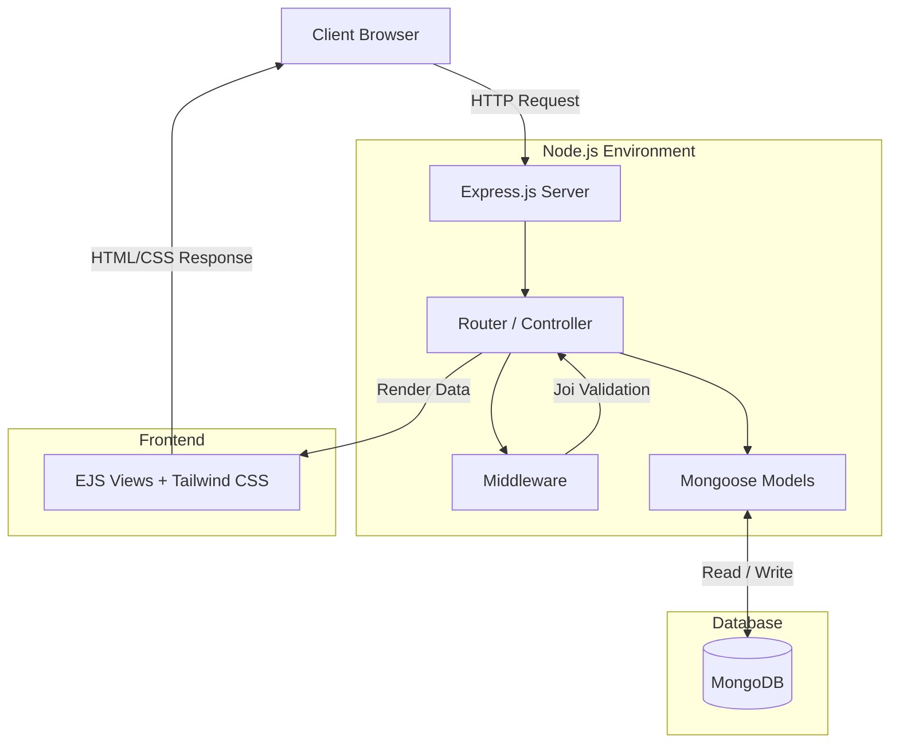

<div align="center">

# 🌟 Null Stay

**A Premium Property Booking Marketplace**

[](#)
[](#)
[](#)
[](#)
[](#)

*Null Stay is a high-fidelity, Airbnb-style property marketplace built to deliver an ultra-premium, cinematic booking experience. Discover stunning beachfront villas, remote cabins, and luxury estates.*

</div>

---

## 🚀 Key Features

- **Premium User Interface**: Luxury-brand aesthetics, full-screen animated hero sections, and custom Bento-Box CSS grid collections.
- **Robust Listing Management (CRUD)**: Create, read, update, and delete property listings seamlessly.
- **Interactive Review System**: Leave comprehensive reviews and 1-5 star ratings for stays, featuring full-screen interactive modals.
- **Form Validation**: Secure and strict request validation implemented using **Joi** to ensure data integrity.
- **Responsive Design**: Mobile-first architecture integrated deeply with **Tailwind CSS**.
- **Solid Error Handling**: Graceful error catching and intuitive fallback UI with a custom Express error handler.

---

## 💻 Tech Stack

### Backend
- **Node.js & Express.js**: High-performance, event-driven server infrastructure.
- **MongoDB & Mongoose**: Flexible NoSQL database and elegant object modeling.
- **Joi**: Powerful schema description language for server-side validation.

### Frontend
- **EJS (Embedded JavaScript) & EJS-Mate**: Dynamic, server-side template rendering with robust layout support.
- **Tailwind CSS**: Utility-first CSS framework for rapid, highly-customizable UI development.

---

## 🏗️ Architecture & Data Flow

Null Stay strictly follows the **Model-View-Controller (MVC)** architectural pattern to ensure separation of concerns, scalability, and clean code maintainability.

### The MVC Breakdown
1. **Models (`/models`)**: Defines MongoDB schemas using Mongoose. Represents the data structure for `Listings` and `Reviews`. Handles business logic related to data.
2. **Views (`/views`)**: EJS templates enhanced with Tailwind CSS. Responsible for rendering the high-fidelity UI to the client.
3. **Controllers/Routes (`index.js`)**: The Express routing layer acts as the controller. It receives HTTP requests, interacts with the Models to fetch/modify data, and renders the appropriate Views.

### Visual Architecture

Below is the high-level system architecture outlining the request lifecycle. 
*(Note: A detailed interactive diagram is available in the [`architecture.excalidraw`](./architecture.excalidraw) file included in this repository. You can open it at [excalidraw.com](https://excalidraw.com/))*



---

## 🛠️ Installation & Setup

Want to run Null Stay locally? Follow these steps:

1. **Clone the repository**
   ```bash
   git clone https://github.com/yourusername/null-stay.git
   cd null-stay
   ```

2. **Install dependencies**
   ```bash
   npm install
   ```

3. **Configure Environment Variables**
   Create a `.env` file in the root directory and add the following:
   ```env
   CONN_PORT=8080
   # Add your MongoDB Connection String
   # MONGO_URI=mongodb://localhost:27017/nullstay 
   ```

4. **Start the development server**
   ```bash
   npm run dev
   # Or using Node directly: node index.js
   ```

5. **Open the Application**
   Visit `http://localhost:8080` in your browser.

---

## 🗺️ Roadmap & Future Enhancements

We are continuously working to make Null Stay the ultimate booking platform. Upcoming features include:
- **Comprehensive Reservation System**: Integration with Stripe for secure payment processing.
- **Double-Booking Prevention Engine**: Real-time calendar synchronization to lock dates.
- **Authentication & Authorization**: Role-based access for Hosts vs. Guests using Passport.js.
- **AI-Powered "Vibe" Search**: Natural language search using vector embeddings (e.g., *"Quiet cabin in the snow"*).

*For a detailed breakdown of upcoming features, check out our [`roadmap.md`](./roadmap.md).*

---

<div align="center">
  <p>Built with ❤️ by Vedant Hande</p>
</div>
